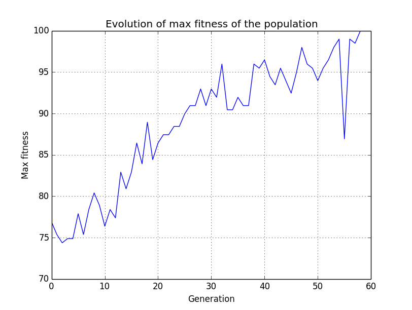

tictactoe-ml
============

Program written in C++ that allows testing of ML techinques to learn how to play Tic-Tac-Toe

## Genetic Algorithm result

    Generation #1: 4.59992, 71.8593(mean=15.4673) 200 individuals
    Generation #2: 6.14182, 73.3668(mean=16.7839) 200 individuals
    Generation #3: 6.28141, 75.3769(mean=16.7136) 200 individuals
    Generation #4: 5.77889, 75.3769(mean=15.4296) 200 individuals
    Generation #5: 5.72864, 72.8643(mean=15.593) 200 individuals
    Generation #6: 5.97432, 77.3869(mean=16.7563) 200 individuals
    Generation #7: 8.79397, 76.8844(mean=17.093) 200 individuals
    Generation #8: 6.59548, 79.397(mean=18.5477) 200 individuals
    Generation #9: 8.18378, 76.3819(mean=18.7437) 200 individuals
    Generation #10: 8.87772, 77.8894(mean=19.2814) 200 individuals
    Generation #11: 5.63931, 75.3769(mean=18.0729) 200 individuals
    Generation #12: 6.97236, 79.397(mean=18.0302) 200 individuals
    Generation #13: 7.1608, 80.9045(mean=19.4899) 200 individuals
    Generation #14: 8.54271, 80.9045(mean=20.8593) 200 individuals
    Generation #15: 7.82484, 78.8945(mean=20.2563) 200 individuals
    Generation #16: 5.4718, 77.3869(mean=18.9472) 200 individuals
    Generation #17: 5.67839, 86.4322(mean=18.397) 200 individuals
    Generation #18: 6.09296, 85.9296(mean=19.6106) 200 individuals
    Generation #19: 6.13065, 87.9397(mean=21.4095) 200 individuals
    Generation #20: 8.11199, 84.9246(mean=22.8869) 200 individuals
    Generation #21: 7.82484, 88.4422(mean=23.6759) 200 individuals
    Generation #22: 8.11199, 86.9347(mean=24.1633) 200 individuals
    Generation #23: 7.68126, 88.4422(mean=22.0101) 200 individuals
    Generation #24: 9.12898, 83.4171(mean=22.1734) 200 individuals
    Generation #25: 10.8878, 84.9246(mean=22.4799) 200 individuals
    Generation #26: 10.9296, 80.402(mean=22.3794) 200 individuals
    Generation #27: 8.84422, 82.4121(mean=23.1884) 200 individuals
    Generation #28: 6.8916, 89.9497(mean=23.4497) 200 individuals
    Generation #29: 8.45896, 87.9397(mean=23.9925) 200 individuals
    Generation #30: 9.94975, 87.9397(mean=23.2211) 200 individuals
    Generation #31: 10.8543, 88.4422(mean=22.4447) 200 individuals
    Generation #32: 8.41709, 85.4271(mean=24.5829) 200 individuals
    Generation #33: 9.67337, 85.9296(mean=25.407) 200 individuals
    Generation #34: 8.54271, 86.4322(mean=24.701) 200 individuals
    Generation #35: 10.4271, 91.4573(mean=25.3995) 200 individuals
    Generation #36: 9.44724, 86.9347(mean=24.2663) 200 individuals
    Generation #37: 6.40704, 84.4221(mean=24.1508) 200 individuals
    Generation #38: 9.92462, 87.4372(mean=24.5151) 200 individuals
    Generation #39: 11.0553, 82.9146(mean=23.6131) 200 individuals
    Generation #40: 6.60445, 84.4221(mean=24.7186) 200 individuals
    Generation #41: 12.1859, 88.4422(mean=25.1759) 200 individuals
    Generation #42: 9.54774, 89.9497(mean=25.5503) 200 individuals
    Generation #43: 10.469, 90.4523(mean=27.3015) 200 individuals
    Generation #44: 12.7638, 90.9548(mean=28.8216) 200 individuals
    Generation #45: 11.9598, 94.4724(mean=29.3618) 200 individuals
    Generation #46: 10.2513, 95.4774(mean=29.7588) 200 individuals
    Generation #47: 14.8241, 96.9849(mean=31.2312) 200 individuals
    Generation #48: 10.4523, 92.9648(mean=28.9623) 200 individuals
    Generation #49: 13.3166, 92.9648(mean=27.897) 200 individuals
    Generation #50: 11.1558, 94.9749(mean=29.6633) 200 individuals
    Generation #51: 12.1321, 94.4724(mean=27.8417) 200 individuals
    Generation #52: 8.37521, 93.4673(mean=30.5201) 200 individuals
    Generation #53: 12.6884, 94.4724(mean=28.1206) 200 individuals
    Generation #54: 13.0653, 91.9598(mean=28.8869) 200 individuals
    Generation #55: 9.54774, 94.9749(mean=27.8593) 200 individuals
    Generation #56: 12.8643, 95.4774(mean=29.5528) 200 individuals
    Generation #57: 12.7303, 94.9749(mean=28.4573) 200 individuals
    Generation #58: 10.122, 97.9899(mean=28.7889) 200 individuals
    Generation #59: 12.3116, 98.4925(mean=31.9824) 200 individuals
    Generation #60: 10.7681, 95.9799(mean=30.3819) 200 individuals
    Generation #61: 15.5779, 96.9849(mean=31.7437) 200 individuals
    Generation #62: 9.04523, 95.9799(mean=31.4497) 200 individuals
    Generation #63: 12.0603, 98.4925(mean=31.5854) 200 individuals
    Generation #64: 11.0553, 92.9648(mean=28.8744) 200 individuals
    Generation #65: 14.9749, 95.4774(mean=32.2437) 200 individuals
    Generation #66: 13.3668, 97.9899(mean=31.7487) 200 individuals
    Generation #67: 12.9816, 93.9698(mean=29.9347) 200 individuals
    Generation #68: 14.1709, 97.9899(mean=29.3492) 200 individuals
    Generation #69: 12.2613, 89.4472(mean=29.8141) 200 individuals
    Generation #70: 11.3065, 97.4874(mean=31.4322) 200 individuals
    Generation #71: 10.0503, 97.9899(mean=29.6231) 200 individuals
    Generation #72: 9.54774, 100(mean=31.9171) 200 individuals
